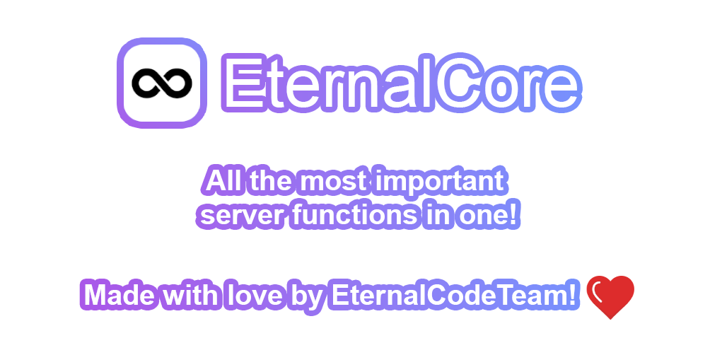

<div align="center">



[](https://papermc.io)
[](https://spigotmc.org)

[](https://www.patreon.com/eternalcode)
[](https://eternalcode.pl/)
[](https://discord.gg/FQ7jmGBd6c)

[](https://gradle.org/)
[](https://www.java.com/)

</div>

# Information's

- EternalCore supports Minecraft latest minor version of each major version starting from 1.17+, eg. 1.17, 1.18, 1.19,
  etc.
- EternalCore requires Java 17 or higher. On older versions, the plugin may not work properly.

# Development builds

Get the development builds from [GitHub Actions](https://github.com/EternalCodeTeam/EternalCore/actions)

<details><summary>Video guide</summary>


</details>

# Features

- Slot Bypass `(eternalcore.bypass.slot)`
- AFK system
- Chat features, including:
    - Admin chat
    - Auto Messages system `(with sequence or random option and command to disable receiving message)`
    - Chat on/off switch
    - Chat slow mode
    - /ignore /unignore `(with -all option)` command
    - /msg, /socialspy /reply command
    - /helpop command
- Open utility blocks with simple commands, such as `/workbench`
- Player inventory viewer
- Player attribute management, including heal, feed, teleportation, and godmode modification
- Ping command to ensure client <-> server connection
- Player information command `(/whois)`
- Home, warp, and spawn system
- PlaceholderAPI support
- Customizable and translatable messages `(Optional player language selection)`
- Advanced configuration system for customizing almost every aspect of the plugin
- Database integration: `(PostGreSQL, SQLite, MySQL, MariaDB, H2)`
- Adventure and [MiniMessage](https://docs.advntr.dev/minimessage/format.html) integration with legacy color
  processing `(e.g &7, &e)` and message destination specification
- And much more!

# Building

To build EternalCore do the following (Make sure you have JDK 17 or higher)

```
./gradlew clean eternalcore-plugin:shadowJar
```

- #### Output file will be located at build/libs

# Contributing

Create a public fork of EternalCore, make changes and then create
a [Pull Request](https://github.com/EternalCodeTeam/EternalCore/pulls) with your appropriate changes.
See [CONTRIBUTING.md](https://github.com/EternalCodeTeam/EternalCore/blob/master/.github/CONTRIBUTING.md) to find out
more.

# License

#### EternalCore is published under the GNU GPL-v3 license. In particular, the developer:

- Is freely allowed to modify and improve the code
- Can distribute production versions
- Must publish any changes made, i.e. the public fork of this repository
- Cannot change the license or copyright

#### Additionally:

- It is forbidden to modify or remove the code responsible for the compliance of production versions with the license.
- The authors of this project are not responsible for using the application, modifying and distributing it.
- Trademarks appearing in this project and this document belong to their rightful owners and are used for informational
  purposes only.

# Other Dependencies usages

- [LiteCommands (by Rollczi ❤️)](https://github.com/Rollczi/LiteCommands)
- [Lombok](https://projectlombok.org/)
- [PaperLib](https://github.com/PaperMC/PaperLib)
- [Spigot API](https://www.spigotmc.org/wiki/spigot-gradle/)
- [Kyori Adventure](https://docs.adventure.kyori.net/)
- [CDN Configs](https://github.com/dzikoysk/cdn)
- [Expressible](https://github.com/panda-lang/expressible)
- [bStats](https://bstats.org/)
- [HikariCP](https://github.com/brettwooldridge/HikariCP)
- [Ormlite JDBC](https://github.com/j256/ormlite-jdbc)
- [TriumphGUI](https://github.com/TriumphTeam/triumph-gui)

# Special thanks

[](https://www.jetbrains.com)

We thank JetBrains for providing [Open Source Licenses](https://www.jetbrains.com/opensource/) for high quality tools.
We recommend using [IntelliJ IDEA](https://www.jetbrains.com/idea/) to work with our projects and accelerate your
productivity!
