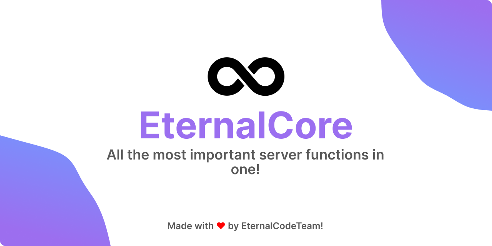

<div align="center">



[](https://www.spigotmc.org/resources/eternalcore-%E2%99%BE%EF%B8%8F-all-the-most-important-server-functions-in-one.112264/)
[](https://modrinth.com/plugin/eternalcore)
[](https://hangar.papermc.io/EternalCodeTeam/EternalCore)

[](https://discord.com/invite/FQ7jmGBd6c)
[](https://docs.eternalcode.pl/eternalcore/introduction)
[](https://bstats.org/plugin/bukkit/EternalCore/13964)
</div>

# Welcome to EternalCore! 🚀

EternalCore is your ultimate companion for enhancing your Minecraft server experience. 💎 Crafted with care, EternalCore is dedicated to incorporating essential and highly practical server functions into a single plugin.

## :information_source: Information

- EternalCore fully supports Minecraft's latest minor versions starting from each major version, starting from 1.17 onward, e.g. `1.17.1`, `1.18.2`, `1.19.4`, `1.20.1`.
- Requires **Java 17 or later** to work properly. For older versions of Java, this may affect the functionality of the plugin.
- If you have any questions, perhaps you will find a solution to them in our [documentation](https://docs.eternalcode.pl/eternalcore/introduction.html), you can also ask us about it on [discord](https://discord.gg/FQ7jmGBd6c).

## :hammer_and_wrench: Development Builds

Get the latest development builds from our [GitHub Actions](https://github.com/EternalCodeTeam/EternalCore/actions).

<details><summary>🎥 Video Guide</summary>
  
</details>

## :sparkles: Features

- :keyboard: Over **60+** useful commands.
- :white_check_mark: Slot Bypass `(eternalcore.bypass.slot)`
- :zzz: AFK System
- :speech_balloon: Chat Features, including:
  - Admin Chat
  - Auto Messages System (with sequence or random options)
  - Chat On/Off Switch
  - Chat Slow Mode
  - /ignore and /unignore (with -all option)
  - /msg, /socialspy, and /reply commands
  - /helpop command
  - Advanced Notification System allowing you to customize every message to your liking (Title, Subtitle, Actionbar, Chat, etc.) 
- :hammer: Open Utility Blocks with simple commands like `/workbench`
- :briefcase: ~~Player Inventory Viewer~~ (We recommend to use: [OpenInv](https://github.com/Jikoo/OpenInv))
- :heart: Player Attribute Management, including heal, feed, teleportation, and godmode modification
- :ping_pong: Ping Command to check client-server connectivity
- :bust_in_silhouette: Player Information Command (`/whois`)
- :house: Home, Warp, and Spawn System
- :page_facing_up: PlaceholderAPI Support
- :memo: Customizable and Translatable Messages (Player language selection available)
- :gear: Advanced Configuration System for customization
- :card_index: Database Integration (PostgreSQL, SQLite, MySQL, MariaDB, H2)
- :rainbow: Adventure and [MiniMessage](https://docs.advntr.dev/minimessage/format.html) integration with legacy color processing (e.g., &7, &e)
- [...and much more!](https://docs.eternalcode.pl/eternalcore/features.html)

## :construction_worker: Developer API

To use EternalCore API, you first need to add EternalCode to your project. To do that follow these steps:
You can check the latest release number [here](github.com/EternalCodeTeam/EternalCore/releases/latest).

1. Add repository:

For Gradle projects use:
```kts
maven("https://repo.eternalcode.pl/releases")
```

For Maven projects use:
```xml
<repository>
    <id>eternalcode-reposilite-releases</id>
    <url>https://repo.eternalcode.pl/releases</url>
</repository>
```

2. Add dependency:

For Gradle projects use:
```kts
compileOnly("com.eternalcode:eternalcore-api:1.1.0")
```

For Maven projects use:
```xml
<dependency>
    <groupId>com.eternalcode</groupId>
    <artifactId>eternalcore-api</artifactId>
    <version>1.1.0</version>
    <scope>provided</scope>
</dependency>
```

3. You are ready to use EternalCoreAPI in your project.

## :building_construction: Building

To build EternalCore, follow these steps (Make sure you have **JDK 17 or higher**):

```shell
./gradlew clean eternalcore-plugin:shadowJar
```
- The output file will be located at `eternalcore-plugin/libs`.


## :octocat: Contributing

Create a public fork of EternalCore, make changes and then create
a [Pull Request](https://github.com/EternalCodeTeam/EternalCore/pulls) with your appropriate changes.
See [CONTRIBUTING.md](https://github.com/EternalCodeTeam/EternalCore/blob/master/.github/CONTRIBUTING.md) to find out
more.


## :bookmark_tabs: Other Dependencies

EternalCore uses various dependencies for its functionality, including:
- [LiteCommands (by Rollczi ❤️)](https://github.com/Rollczi/LiteCommands)
- [Lombok (Only for configs)](https://projectlombok.org/)
- [PaperLib](https://github.com/PaperMC/PaperLib)
- [Spigot API](https://www.spigotmc.org/wiki/spigot-gradle/)
- [Kyori Adventure](https://docs.adventure.kyori.net/)
- [CDN Configs](https://github.com/dzikoysk/cdn)
- [Expressible](https://github.com/panda-lang/expressible)
- [bStats](https://bstats.org/)
- [HikariCP](https://github.com/brettwooldridge/HikariCP)
- [Ormlite JDBC](https://github.com/j256/ormlite-jdbc)
- [TriumphGUI](https://github.com/TriumphTeam/triumph-gui)

## :heart: Special Thanks

[](https://www.jetbrains.com)

We express our gratitude to JetBrains for providing [Open Source Licenses](https://www.jetbrains.com/opensource/) for their outstanding tools. We recommend using [IntelliJ IDEA](https://www.jetbrains.com/idea/) to work with our projects and boost your productivity!
